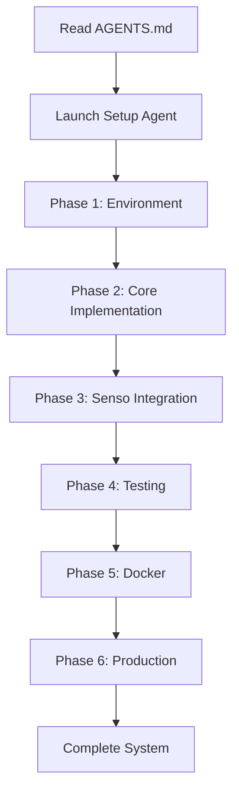

# Hey Listen - Audio Transcription System

Real-time audio transcription system that captures conversations, transcribes them using Whisper, and organizes data in Senso.ai for intelligent retrieval.

## Quick Start

### Prerequisites
- Python 3.9+
- Docker Desktop (for containerized deployment)
- Microphone
- Senso.ai API key ([contact support@senso.ai](mailto:support@senso.ai))

### Installation

```bash
# Clone the repository
git clone <your-repo-url>
cd hey-listen

# Create virtual environment
python3 -m venv venv
source venv/bin/activate  # On Windows: venv\Scripts\activate

# Install system dependencies (macOS)
brew install portaudio

# Install Python dependencies
pip install -r requirements.txt

# Configure environment
cp .env.example .env
# Edit .env and add your SENSO_API_KEY
```

### Run Locally

```bash
# Activate virtual environment
source venv/bin/activate

# Run the audio worker
python src/audio_worker.py
```

### Run with Docker

```bash
# Build and run
docker-compose up -d

# View logs
docker-compose logs -f audio-worker

# Stop
docker-compose down
```

## 🤖 Automated Setup with Claude Code Agents

This project includes automated setup and implementation using Claude Code specialized agents. Instead of following the manual steps in AGENTS.md, you can use AI agents to execute the entire implementation programmatically.

### Using Specialized Agents

The `AGENTS.md` file contains a comprehensive step-by-step guide. You can execute these steps programmatically using Claude Code's specialized agents:

#### 1. **Full Project Setup Agent**

Run all phases automatically:

```bash
# Using Claude Code CLI
claude-code task --agent general-purpose \
  --description "Implement Hey Listen project" \
  --prompt "Follow the implementation guide in AGENTS.md to set up the complete Hey Listen audio transcription system. Execute all 6 phases:
  1. Environment setup
  2. Core implementation
  3. Senso.ai integration
  4. Testing & validation
  5. Docker deployment
  6. Production readiness

  Read AGENTS.md for detailed instructions and implement each step programmatically. Verify each phase before moving to the next."
```

#### 2. **Phase-by-Phase Agent Execution**

Execute specific phases individually:

**Phase 1: Environment Setup**
```bash
claude-code task --agent general-purpose \
  --description "Setup development environment" \
  --prompt "Read AGENTS.md Phase 1 and execute all environment setup steps: create directory structure, install dependencies, configure environment variables, and validate the setup."
```

**Phase 2: Core Implementation**
```bash
claude-code task --agent general-purpose \
  --description "Implement audio worker" \
  --prompt "Read AGENTS.md Phase 2 and implement the AudioWorker class with audio capture, transcription, and diarization. Follow the exact code structure specified in the guide."
```

**Phase 3: Senso.ai Integration**
```bash
claude-code task --agent general-purpose \
  --description "Integrate Senso.ai API" \
  --prompt "Read AGENTS.md Phase 3 and implement Senso.ai integration: add ingestion method, implement main run loop, and validate API connectivity."
```

**Phase 4: Testing**
```bash
claude-code task --agent general-purpose \
  --description "Run comprehensive tests" \
  --prompt "Read AGENTS.md Phase 4 and execute all testing scenarios: manual testing, Senso.ai verification, and unit tests. Create test reports for each scenario."
```

**Phase 5: Docker Setup**
```bash
claude-code task --agent general-purpose \
  --description "Containerize application" \
  --prompt "Read AGENTS.md Phase 5 and create Docker configuration: Dockerfile, docker-compose.yml, build images, and validate containerized deployment."
```

**Phase 6: Production Readiness**
```bash
claude-code task --agent general-purpose \
  --description "Production hardening" \
  --prompt "Read AGENTS.md Phase 6 and implement production features: retry logic, health monitoring, file logging, and configuration management."
```

#### 3. **Parallel Agent Execution**

Run multiple phases concurrently (for experienced users):

```bash
# Example: Run testing and Docker setup in parallel
claude-code task --parallel \
  --agent general-purpose --description "Run tests" --prompt "Execute AGENTS.md Phase 4 testing" \
  --agent general-purpose --description "Setup Docker" --prompt "Execute AGENTS.md Phase 5 Docker configuration"
```

### Agent Workflow



### Benefits of Agent-Driven Setup

- **Consistency**: Agents follow exact specifications from AGENTS.md
- **Speed**: Automated execution vs manual copy-paste
- **Validation**: Agents verify each step before proceeding
- **Error Handling**: Automatic retry and troubleshooting
- **Documentation**: Agents generate logs of all actions taken

### Agent Task Templates

Create reusable task templates for common operations:

**troubleshoot-agent.json**
```json
{
  "agent": "general-purpose",
  "description": "Troubleshoot Hey Listen issues",
  "prompt": "Read the Troubleshooting section in AGENTS.md and diagnose the following issue: {issue_description}. Apply recommended solutions and verify the fix."
}
```

**enhance-agent.json**
```json
{
  "agent": "general-purpose",
  "description": "Add enhancement to Hey Listen",
  "prompt": "Read AGENTS.md Next Steps section and implement the following enhancement: {enhancement_name}. Follow the implementation patterns established in the core system."
}
```

## Project Structure

```
hey-listen/
├── AGENTS.md                    # Automated implementation guide
├── README.md                    # This file
├── requirements.txt             # Python dependencies
├── .env.example                 # Environment template
├── .env                         # Your configuration (git-ignored)
├── .gitignore                   # Git ignore rules
├── Dockerfile                   # Docker image definition
├── docker-compose.yml           # Docker orchestration
├── src/
│   └── audio_worker.py         # Main audio worker implementation
├── tests/
│   ├── test_unit.py            # Unit tests
│   └── fixtures/               # Test data
└── insights/                    # Detailed documentation
    ├── 01-project-overview.md
    ├── 02-requirements.md
    ├── 03-senso-api-integration.md
    ├── 04-audio-worker-implementation.md
    ├── 05-docker-setup.md
    └── 06-testing-guide.md
```

## Documentation

- **[AGENTS.md](./AGENTS.md)**: Complete step-by-step implementation guide (can be executed by AI agents)
- **[insights/](./insights/)**: Detailed technical documentation
  - [Project Overview](./insights/01-project-overview.md)
  - [Requirements](./insights/02-requirements.md)
  - [Senso.ai Integration](./insights/03-senso-api-integration.md)
  - [Audio Worker Implementation](./insights/04-audio-worker-implementation.md)
  - [Docker Setup](./insights/05-docker-setup.md)
  - [Testing Guide](./insights/06-testing-guide.md)

## Configuration

Key environment variables in `.env`:

```bash
# Senso.ai API Configuration
SENSO_API_KEY=your_api_key_here

# Whisper Model (tiny, base, small, medium, large)
WHISPER_MODEL=tiny

# Audio Configuration
CHUNK_DURATION=5        # Seconds per audio chunk
SAMPLE_RATE=16000       # Hz
```

## Usage Examples

### Basic Usage

```bash
# Start the worker
python src/audio_worker.py

# The worker will:
# 1. Capture 5-second audio chunks
# 2. Transcribe using Whisper
# 3. Identify speaker (basic diarization)
# 4. Upload to Senso.ai knowledge base
```

### Search Your Transcriptions

```bash
# Using Senso.ai API
curl -X POST https://sdk.senso.ai/api/v1/search \
  -H "X-API-Key: YOUR_KEY" \
  -H "Content-Type: application/json" \
  -d '{
    "query": "what did we discuss about the project timeline?",
    "max_results": 5
  }'
```

### Docker Deployment

```bash
# Production deployment
docker-compose up -d

# Monitor logs
docker-compose logs -f audio-worker

# Scale workers (if needed)
docker-compose up -d --scale audio-worker=3
```

## Troubleshooting

Common issues and solutions:

### Microphone Access Issues
```bash
# macOS: Grant microphone permissions
# System Preferences → Security & Privacy → Microphone

# Linux: Add user to audio group
sudo usermod -a -G audio $USER
```

### API Key Issues
```bash
# Verify API key is set
echo $SENSO_API_KEY

# Test API connectivity
curl -X GET https://sdk.senso.ai/api/v1/health \
  -H "X-API-Key: YOUR_KEY"
```

### High CPU Usage
```bash
# Use smaller Whisper model
export WHISPER_MODEL=tiny

# Increase chunk duration
export CHUNK_DURATION=10
```

See [AGENTS.md Troubleshooting](./AGENTS.md#troubleshooting) for comprehensive solutions.

## Testing

```bash
# Run unit tests
pip install pytest pytest-mock
pytest tests/test_unit.py -v

# Manual testing
python src/audio_worker.py
# Speak: "This is a test transcription"
# Check logs for transcription output and Senso.ai content ID
```

## Development

### Adding Features

1. Read the relevant section in [AGENTS.md](./AGENTS.md)
2. Use an agent to implement programmatically:
   ```bash
   claude-code task --agent general-purpose \
     --description "Add new feature" \
     --prompt "Implement {feature_name} following the patterns in AGENTS.md and existing code"
   ```
3. Run tests and validate
4. Update documentation

### Code Style

Follow the established patterns in `src/audio_worker.py`:
- Comprehensive docstrings
- Error handling with logging
- Type hints where appropriate
- Clear separation of concerns

## Roadmap

- [ ] Real speaker diarization with pyannote.audio
- [ ] Multi-language support
- [ ] Real-time streaming (WebSocket)
- [ ] Context-aware decision agent
- [ ] Custom wake word detection
- [ ] Calendar/task integration

See [AGENTS.md Next Steps](./AGENTS.md#next-steps) for detailed roadmap.

## Contributing

1. Fork the repository
2. Create a feature branch
3. Use agents to implement following AGENTS.md patterns
4. Add tests
5. Submit pull request

## License

[Add your license here]

## Support

- **Senso.ai API**: support@senso.ai
- **Issues**: [GitHub Issues](link-to-issues)
- **Documentation**: See `insights/` folder

## Acknowledgments

- OpenAI Whisper for speech-to-text
- Senso.ai for knowledge management
- Claude Code for automated implementation

---

**Pro Tip**: For fastest setup, use the automated agent workflow described in the "Automated Setup with Claude Code Agents" section above. The entire system can be implemented programmatically by running agents against AGENTS.md.
